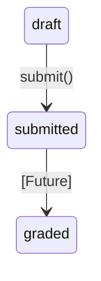

# P1-3B Submission Foundation Implementation Plan

## 1. Implementation Scope

This phase (P1-3B) implements the foundational submission architecture for the LMS.

**YES (Included):**
- `submissions` table migration
- `Submission` model
- `SubmissionPolicy`
- `StoreSubmissionRequest`
- `UpdateSubmissionRequest`
- Submit lifecycle action (transition from draft to submitted)
- Santri submission controller
- Ustadz submission viewing controller
- Routes
- Feature tests

**NO (Excluded):**
- Grading workflow
- Score calculation
- Feedback
- File upload
- Notifications
- Penilaian synchronization
- Grade publishing
- Admin LMS UI

## 2. Migration Plan

**Migration Order:**
- `assignments` table already exists.
- Create `submissions` table migration.

**Columns:**
- `id` (Primary Key, UUID/BigInt as per project standard)
- `assignment_id` (Foreign Key, ON DELETE RESTRICT)
- `santri_id` (Foreign Key, ON DELETE RESTRICT)
- `content` (Text)
- `status` (String/Enum: 'draft', 'submitted')
- `submitted_at` (Timestamp, nullable)
- `timestamps()`

**Constraints:**
- `assignment_id`: Foreign key referencing `assignments.id`, `ON DELETE RESTRICT`
- `santri_id`: Foreign key referencing `santris.id`, `ON DELETE RESTRICT`

**Indexes:**
- Unique constraint on `['assignment_id', 'santri_id']`: One santri, one submission per assignment.

**Rollback Safety:**
- Dropping the `submissions` table does not orphan external records as it is a leaf node dependent on `assignments` and `santris`.
- Using `ON DELETE RESTRICT` prevents accidental deletion of assignments or santris that have associated submissions, ensuring data integrity.

## 3. Submission Model Design

**Fillable Fields:**
- `assignment_id`
- `santri_id`
- `content`
- `status`
- `submitted_at`

**Relationships:**
- `belongsTo(Assignment::class)`
- `belongsTo(Santri::class)`

**Accessors:**
- `isLate()`: Evaluates to `true` if `submitted_at` > `assignment.due_date`.

**Derived State Explanation:**
- `late` is a derived property and **must not** be stored in the database. It is calculated dynamically based on the `submitted_at` timestamp compared to the `assignment.due_date`.

## 4. Lifecycle Design

**Implementation State Machine:**

**Implementation in P1-3B:**
- **Allowed:** `draft` -> `submitted`
- **Not implemented:** `submitted` -> `graded`

**Controller Action Responsibility:**
- The `submit()` controller action is exclusively responsible for transitioning the state from `draft` to `submitted` and setting the `submitted_at` timestamp.
- **No arbitrary status update** is allowed from the request payload (e.g., users cannot send `status: submitted` in a generic update endpoint).

## 5. SubmissionPolicy Design

**Methods:**
- `before()`
- `view()`
- `update()`
- `submit()`

**Authorization Rules:**

*Santri:*
- **Can:**
  - View own submission
  - Update own draft submission
  - Submit own draft submission
- **Cannot:**
  - Access other santri submissions
  - Update a submitted submission
  - Choose `santri_id` (implicitly uses authenticated user's santri context)

*Ustadz:*
- **Can:**
  - View submissions belonging to assignments owned by them
- **Cannot:**
  - Access another ustadz's assignment submissions

*Admin:*
- `before()` full access (intercepts and grants all permissions)

## 6. Request Validation Design

**StoreSubmissionRequest:**
- **Must validate:**
  - Assignment exists
  - Assignment belongs to an active academic period
  - Assignment status is open/published
  - Assignment `kelas` matches the santri's `kelas`
- **Must NOT accept:**
  - `santri_id` (injected by controller)
  - `academic_period_id` (derived/injected)

**UpdateSubmissionRequest:**
- **Only allows:**
  - `content` modification
- **Only when:**
  - `submission.status` = `draft`
- **No status field allowed** in the payload.

## 7. Controller Design

**Santri SubmissionController Responsibilities:**
- Create submission (store as draft)
- Update draft
- Submit draft (action to transition state)
- View own submissions

**Ustadz SubmissionController Responsibilities:**
- View submissions for owned assignments

**Clarification:**
- The **Policy** handles authorization boundaries (who can do what).
- The **Controller** handles workflow and payload injection (setting `santri_id`, managing state transitions securely).

## 8. Routes Design

**Santri Routes:**
- `GET /submissions` (or nested under assignments)
- `GET /submissions/create`
- `POST /submissions` (store)
- `PUT /submissions/{submission}` (update)
- `POST /submissions/{submission}/submit` (submit)

**Ustadz Routes:**
- `GET /assignments/{assignment}/submissions` (view submissions for a specific assignment)

**Middleware:**
- `auth`
- `role` middleware (Santri for santri routes, Ustadz for ustadz routes)

## 9. Testing Strategy

Create the following test files:
- `tests/Feature/Santri/SubmissionTest.php`
- `tests/Feature/Ustadz/SubmissionAccessTest.php`

**Mandatory Tests:**

*Ownership:*
- Santri cannot view another santri's submission

*Assignment Boundary:*
- Santri cannot submit an assignment from another kelas

*Academic Period:*
- Santri cannot submit an assignment from an inactive academic period

*Injection:*
- `santri_id` payload is ignored/rejected
- `academic_period_id` payload is ignored/rejected

*Lifecycle:*
- Draft can update
- Submitted cannot update
- Draft can submit
- Submitted cannot submit again

*Ustadz:*
- Ustadz can view submissions of their own assignment
- Ustadz cannot view another Ustadz's assignment submissions

## 10. Data Integrity Review

**Explicit Verification:**
- **No duplicate submission:** Enforced by unique composite index on `assignment_id` + `santri_id`.
- **No orphan submission:** Enforced by `ON DELETE RESTRICT` foreign keys.
- **No historical deletion:** `ON DELETE RESTRICT` prevents deletion of assignments/santris with active submissions.

## 11. Dependency Order

Implementation sequence:
1. Migration
2. Model
3. Policy
4. Requests
5. Controllers
6. Routes
7. Tests
8. Verification

## 12. PR Boundary

- **Single PR:** "P1-3B Submission Foundation"
- **No UI implementation:** UI remains in scope for P1-3C.

## 13. Verification Checklist

Before implementation completion, run:
- `php artisan test`
- `vendor/bin/pint --test`
- `npm run build`
- `git diff --check`
